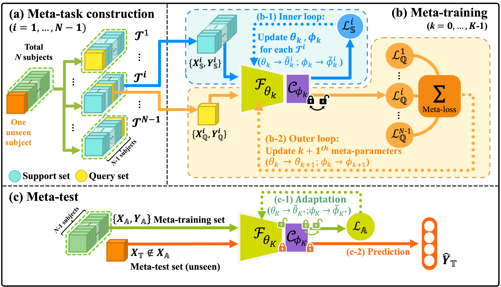
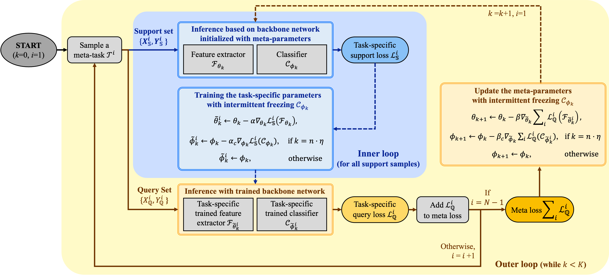

# **META-EEG: Meta-learning-based Class-relevant EEG Representation Learning for Zero-calibration Brain--computer Interfaces**
This is the **official** PyTorch implementation of "[META-EEG: Meta-learning-based Class-relevant EEG Representation Learning for Zero-calibration Brain-computer Interfaces](https://www.sciencedirect.com/science/article/pii/S0957417423024880)", which has been accepted for publication in Expert Systems with Applications (ESWA) in 2023.
Our pytorch implementations of MAML-based frameworks are based on [higher](https://github.com/facebookresearch/higher).  


## Abstract
Transfer learning for motor imagery-based brain-computer interfaces (MI-BCIs) struggles with inter-subject variability, hindering its generalization to new users. This paper proposes an advanced implicit transfer learning framework, META-EEG, designed to overcome the challenge arising from inter-subject variability. By incorporating gradient-based meta-learning with an intermittent freezing strategy, META-EEG ensures efficient feature representation learning, providing a robust zero-calibration solution.  
A comparative analysis reveals that META-EEG significantly outperforms all the baseline methods and competing methods on three different public datasets. Moreover, we demonstrate the efficiency of the proposed model through a neurophysiological and feature-representational analysis. With its robustness and superior performance on challenging datasets, META-EEG provides an effective solution for calibration-free MI-EEG classification, facilitating broader usability.  

### Overview of META-EEG
<p align="center">
    
</p>

### Workflow chart for training META-EEG
<p align="center">
    
</p>

---
## Requirment 
- python >= 3.9
- pytorch >= 1.12
- numpy >= 1.25
  
---
## Preparation
We have not attached the dataset files in ```.npy``` format inside the library and code files due to storage limitation. Hence, ```srcdat_```, ```srclbl_``` on line 174 and ```zrdat_```, ```zrlbl_``` on line 175 of ```main.py``` have been replaced with random values. Replace these two lines with the meta-training dataset and the unseen subject dataset of your desired EEG signal dataset, respectively. The datasets used in this study are BCI Competition IV-2a and 2b and CBCIC datasets, which can be downloaded from the links below:
- [BCI Competition IV-2a & BCI Competition IV-2b](https://www.bbci.de/competition/iv/)
- [CBCIC](https://github.com/5anirban9/Clinical-Brain-Computer-Interfaces-Challenge-WCCI-2020-Glasgow)


## Usage
Our code can be executed with the configuration file 'train.yaml.' An example run for training the main code is as follows:
<br>
```bash
python main.py --config=./train.yaml
```
---
If you discover value in this content, kindly reference the following article:
## Citation 
```bibtex
@article{han2023meta,
  title={META-EEG: Meta-learning-based class-relevant EEG representation learning for zero-calibration brain-computer interfaces},
  author={Han, Ji-Wung and Bak, Soyeon and Kim, Jun-Mo and Choi, WooHyeok and Shin, Dong-Hee and Son, Young-Han and Kam, Tae-Eui},
  journal={Expert Systems with Applications},
  pages={121986},
  year={2023},
  publisher={Elsevier}
}
```
---
  
  
## Acknowledgements
This work was supported by the Institute of Information and Communications Technology Planning and Evaluation (IITP) grant funded by the Korean government (MSIT) (No. 2019-0-00079, Artificial Intelligence Graduate School Program at Korea University, No. 2017-0-00451, Development of BCI based Brain and Cognitive Technology for Recognizing User’s Intentions using Deep Learning, and No. 2022-0-00871, Development of AI Autonomy and Knowledge 
## Contact Us
This post was published through the official MAILAB account, and the issues tab has been disabled. If you encounter any issues while running the code or spot errors, please reach out to the code authors below:

- Ji-Wung Han: daniel_han@korea.ac.kr
- Soyeon Bak: soypark@korea.ac.kr  

You can also locate their official GitHub accounts in the contributors list.

